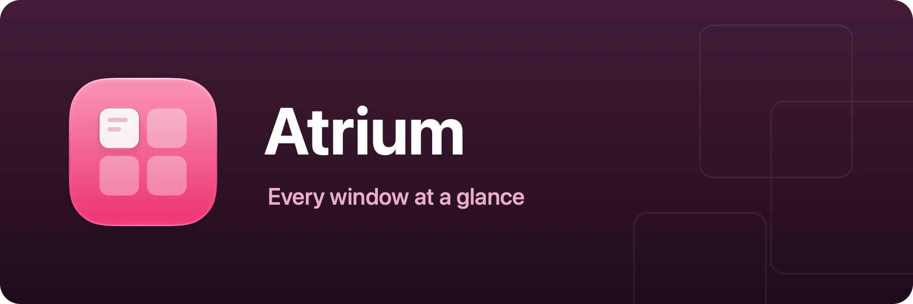

<p align="center">
  
</p>

<p align="center">
  A macOS window switcher in the spirit of AltTab, press <kbd>Option+Tab</kbd> and every
  window of every app, minimized ones included, appears in a panel on the screen you're on.<br />
  A single Swift Package (Sparkle is the only dependency), builds with the <code>swift</code> CLI alone, no Xcode project required.
</p>

## How it works

- **Option+Tab** opens the switcher on the screen under the mouse cursor and steps forward;
  keep tapping Tab (with Option held) to keep cycling.
- **Option+Shift+Tab** cycles backwards. Holding Tab down keeps cycling (system-style key
  repeat), and the **arrow keys** move the selection too, left/right with wraparound,
  up/down by row. Hovering with the mouse also moves the selection.
- **Option+`** opens the same switcher scoped to the frontmost app's own windows, the
  panel version of the system's ⌘` (Option+Shift+` cycles backwards).
- **Release Option** to switch to the selected window, a quick tap jumps straight to the
  window you were just in. Minimized windows are restored, hidden apps unhidden.
- **Return** (or clicking an entry) switches to the highlighted window; **Escape** cancels.
- Windows are listed front-to-back; minimized windows, hidden apps, and windows on other
  Spaces trail at the end, drawn dimmed.
- Each card shows a **live window preview** with the app icon as a badge. On-screen
  windows capture via ScreenCaptureKit. Minimized/hidden windows, even ones never shown
  since launch, capture from the window server's retained backing store (private
  SkyLight API, resolved at runtime so it degrades gracefully if it ever disappears).
  Previews are cached per window and persisted to disk across relaunches (cleared on
  reboot, since window IDs reset), so the panel opens with pictures already in place and
  refreshes them silently.
- The panel itself is clear **Liquid Glass** with the same tuned material as Transom's
  HUD, plus a specular rim re-derived for the panel's size.

Atrium needs the **Accessibility** permission, that's how it enumerates and raises other
apps' windows. First launch shows an onboarding window that walks through the grant (and
stays until it's done). Window previews additionally need **Screen Recording**, offered as
an optional step there (granting takes effect on the next launch); without it the switcher
just shows app icons.

## Building the app

```sh
./Scripts/bundle.sh
open build/Atrium.app
```

The app icon is compiled from the Icon Composer document at `Assets/AppIcon.icon` (generated by
`swift Scripts/make-assets.swift`), so on macOS 26+ the system renders it live with the Liquid
Glass treatment, including the dark, clear, and tinted variants.

Local distributable builds: `CODESIGN_IDENTITY="Developer ID Application" ./Scripts/bundle.sh`
signs with hardened runtime + timestamp instead of ad-hoc.

### Release signing & notarization

Releases are published by the GitHub workflow when a version tag is pushed
(`git tag v0.1.0 && git push origin v0.1.0`). It signs and notarizes automatically when
these repository secrets exist (without them, releases fall back to ad-hoc signing):

| Secret | Value |
| --- | --- |
| `DEVELOPER_ID_P12` | Developer ID Application certificate + private key, exported as `.p12` from Keychain Access, then base64-encoded (`base64 -i cert.p12`) |
| `DEVELOPER_ID_P12_PASSWORD` | Password chosen when exporting the `.p12` |
| `NOTARY_KEY_P8` | Contents of an App Store Connect API key (`.p8`, Developer role) |
| `NOTARY_KEY_ID` | The API key's Key ID |
| `NOTARY_ISSUER_ID` | The API key's Issuer ID |
| `SPARKLE_ED_PRIVATE_KEY` | Sparkle EdDSA private key (`generate_keys -x`) for signing auto-updates, must match `SUPublicEDKey` in `Scripts/Info.plist` |

### Auto-updates (Sparkle)

The app updates itself via [Sparkle](https://sparkle-project.org): it checks the feed at
`appcast.xml` on `main` (see `SUFeedURL` in `Scripts/Info.plist`). After publishing a release,
the workflow signs the notarized zip with the Sparkle private key and commits a new appcast
entry, no manual steps.

Release notes come from `CHANGELOG.md`: write a `## <version>` section before tagging (the
release fails early without one). The workflow publishes that section as the GitHub release
body and embeds it (rendered to HTML) in the appcast entry, so the update dialog shows the
same notes.

Sparkle is Developer-ID-distribution only, a future App Store variant must compile out
`UpdaterController.swift` and the Sparkle dependency (App Review 2.5.2 forbids self-updaters).

## Development

```sh
swift run             # run once
./Scripts/dev.sh      # rebuild & relaunch on source changes
./Scripts/test.sh     # unit tests (equivalent to `swift test`)
```

Swift Testing needs full Xcode, Command Line Tools alone won't run it.

## Code structure

```
Sources/Atrium/
├── main.swift                # Entry point (accessory app, no Dock icon)
├── AppDelegate.swift         # Menu bar item, onboarding gate, shortcut wiring
├── OnboardingWindow.swift    # First-run walkthrough + permission gates
├── HotKeyCenter.swift        # Global shortcuts via Carbon RegisterEventHotKey
├── SelectionCycler.swift     # Pure wraparound selection arithmetic (tested)
├── AccessibilityWindow.swift # AX wrapper: titles, minimized state, raise/focus
├── WindowEnumerator.swift    # Every app's windows, z-ordered (ordering core tested)
├── PreviewLoader.swift       # Window screenshots: ScreenCaptureKit + SkyLight + cache
├── SwitcherController.swift  # Show → cycle → commit lifecycle of the switcher
├── SwitcherPanel.swift       # The layered overlay panel and its item views
└── UpdaterController.swift   # Sparkle auto-update
```

## Roadmap

- **Recency ordering**: most-recently-used order across invocations, like the system switcher.
- **Configurable shortcuts**: the recorder + System Settings–style window the sibling apps use.
- **More gestures**: close/minimize the selected window from the switcher, per-app cycling.
- **Overflow handling**: scroll or shrink when the window count outgrows the screen.

## License

MIT, see [LICENSE](LICENSE). Bundled third-party software and its licenses are listed in [THIRD-PARTY-NOTICES.md](THIRD-PARTY-NOTICES.md).

Inspired by [AltTab](https://github.com/lwouis/alt-tab-macos). No code is shared.
